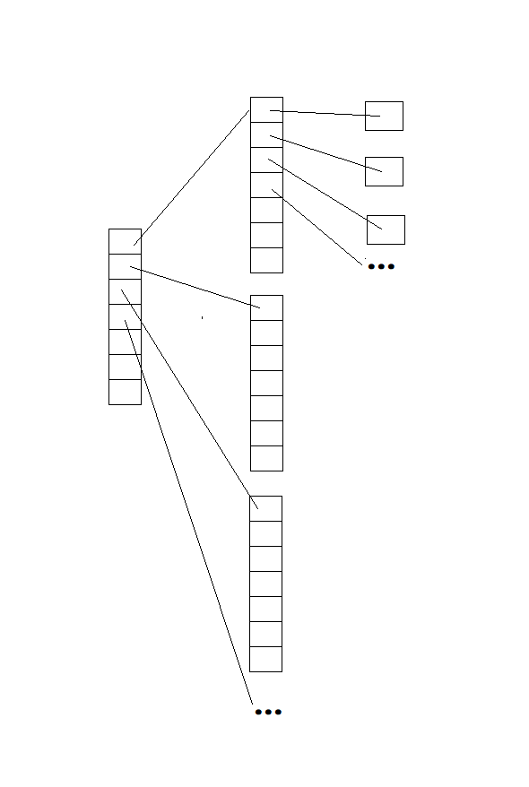
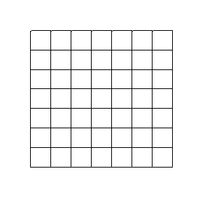

# C Sharp

> Grammar

* sealed

```c#
// The sealed modifier prevents other classes from inheriting from it.
// 当你不想让别的类去继承某一类时使用 sealed 关键字（类似Java 的 final用法）
// 系统库类中的String类就是这样的
sealed class A{}
class B {}

// Error
// 这时将不能继承A类
class C : A {}

// Right
// 可以继承B类
class C : B {}

```

* internal
```c#
// The internal keyword is an access modifier for type and type members
// Internal types or members are accessible only whthin files in the same assemblely(the same .dll file)
// internal 关键字主要用于限定被修饰变量的可被访问的区间或范围，同一个.dll中的类可以访问这种类型的变量（类似java protected,只有在同一个包下才可以访问）

// e.g.
// Assembly1.cs
internal class BaseClass{
    public static int i = 0;
}

// Assembly2.cs
class TestAccess{
    static void Main(){
        // Error. No Access!
        var myBase = new BaseClass();
    }
}
```

* where

```c#
// 1. The where clause in a generic definition specifies constrains on the types that are used as arguments for type parameters in a generic type, method, delegate. Constrains cans specify interfaces, base classes, or other type to be a reference.
// 向上限定，如果传入的泛型只能是其基类（父类）本身，或衍生类（子类）

// The type of T is the sub class of MonoBehaviour or itself. 
// 这里运用where可以实现，这个T类型必须是MonoBehaviour本身或其衍生类（子类）
public class Singleton<T> : MonoBehaviour where T : MonoBehaviour{
    
}


// 2.The where clause is used in a query expression to specify which elements from the data source will be returned in the query expression.
// where还可以用于查询表达式，可以通过它对一个数据集合进行过滤处理，只保留符合条件的数据
int[] numbers = { 5, 4, 1, 3, 9, 8, 6, 7, 2, 0 };

// In the following example, the where clause filters out all numbers except those that are less than five.
// queryLowNums来接受过滤后的结果
var queryLowNums =
    from num in numbers
    where num < 5
    select num;

// Execute the query.
// 这里输出原来numbers 数组中小于5的所有元素
foreach (var s in queryLowNums)
{
    Console.Write(s.ToString() + " ");
}
```

* new

```c#
// 1.The new constraint specifies that a type arguments in a generic class declaration must have a public parameterless constructor. To use the new constraint, the type cnanot be abstract.
// where T : new() 表示 T可以被new出来，而对于抽象类接口是不能被new出来的，所以T一定不是抽象类和接口,(where的用法请看上面)
class Factory<T> where T : new(){
    public T GetFactory(){
        
        // 如果没有上面的 这里将不能使用 new
        return new T();
    }
}
// 2.When use the new() constraint with others, it must be specified last
// 如果where后面有多个限定，必须将new()放在最后
public class Factory<T> where T : IComparable, new(){
    
}
```


* as

```c#
// 1.The as operator explicitly converts the result of an expression ti a given reference or nullable value type. 
// 2.If the conversion is not possiable, the as operator returns null. 
// 3.Unlike a cast expression, the as operator never throws an exception.
/*
	as 可以显式的对“引用类型”的变量进行转换，（这也就说明对于“基本类型”是不能用as进行类型转换的），传统的方法我们之间使用类似这样的表达式进行强转如下
	eg.
	// 基本数据类型（存放在栈中，没有new的结构体也是存放在栈中）
		int integer = 10;
		// 显式转换
		double doub1 = (double)integer;
		
		// 隐式转换（系统默认可以将低精度的类型转换为高精度的类型，只要数据没有缺失，系统就可以自动进行转换）
		double doub2 = integer;
		
	// 引用类型（实际是一个句柄，指向堆中的一块内存）
	class 爸爸{
		string name;
	}
	class 孩子{
		// 改方法在爸爸类中没有
		public void 孩子方法(){}
	}
	
	...main(){
		爸爸 fa = new 孩子();
        
        // 只能调用爸爸类中的方法
        ...
        
        // 如果知道fa其实指向的是一个孩子类，那么可以这样
        孩子 ch = (孩子)fa;
        孩子 ch1 = fa as 孩子;
        
        // 可以正常的调用孩子方法
        ch.孩子方法();
        ch1.孩子方法();
        
        // 这里主要说说这两种的区别
        
        // 若实际上fa指向的不是孩子类或则孩子类的子类，这样的转换将会报错
        // 孩子 ch = (孩子)fa;
        
        // 若实际上fa指向的不是孩子类或则孩子类的子类，这样的转换ch1将会被赋值为null，而没有报错
        // 孩子 ch1 = fa as 孩子;
        
	}
*/


// Uage of key word of as
// 使用 as
String str1 = "nori";
Object temp = st1;

// conversion

// Right conversion
// 正确的转换
String st2 = temp as String;
String st2 = (String)temp;

// Error conversion
// Use as
// There is not error and not throw an exception, but c is given null
// 错误的转换没有抛出异常，只是把c赋值为null
Char c = temp as Char;

//Use common way
// There is error and will throw an exception
// 传统做法，将会抛出异常
Char c = (Char)temp;

```


* Properties(Get, Set function)

```c#
public class Player
{
    void Start()
    {
        Player player= new Player();
        player.Experience = 10;
        int x = player.Experience;
    }
    
    private int experience;
    
    public int Experience
    {
        get
        {
            return experience;
            // also add some steps
            // 也可以加一些运算操作返回
            // return experience / 100;
        }
        set
        {
            experience = value;
            // experience = value * 100;
        }
    }
}
```

* static

```c#
// test
public class Analyze
{
	public void getEnemyNumber(){
        Enemy enemy01 = new Enemy();
        Enemy enemy02 = new Enemy();
        
        Player player01 = new Player();
        Player player02 = new Player();
        
		// directly access the variable of enemyNumber
		// 直接访问enemyNumber变量
        // output 4
  		// 输出4
		int totalNumber = CalUtil.plus(Enemy.enemyNumber, Player.playerNumber);
	}
}

// Apply to common class
// 在普通的类中使用
public class Enemy
{
	public static int enemyNumber = 0;
    
    public Enemy(){
        Enemy.enemyNumber++;
        // Enemy.enemyNumber++;
    }
}
public class Player
{
	public static int playerNumber = 0;
    
    public Player(){
        Player.playerNumber++;
        // Enemy.playerNumber++;
    }
}

// Apply to Utility class
// 在工具类中使用
class CalUtil
{
	public static int plus(int num1, int num2){
        return num1 + num2;
    }
}
```

* Generics

```c#
// Test
public class Test
{
    // Generic class
    GenericClass<String> genericClass = new GenericClass<String>();
    genericClass.UpdateItem(new String("Nori"));
    
    // Generic method
    SomeClass someClas = new SomeClass();
    String str = someClas.getGeneric<String>();
}


// Apply to generic class
// 在类上使用泛型
public class GenericClass <T>
{
    T item;
    
    public void UpdateItem(T item){
        this.item = item;
    }
}

// Apply to generic method
// 在方法上使用泛型
public class SomeClass
{
    public T getGeneric<T>(T parameter){
        return parameter;
    }
}
```

* Hide Function(new modifier)

```c#
/* 
	When used as a declaration modifier, the new keyword explicitly hides a member that is inherited from a base
class.When you hidean inherited member, the derived version of the member replaces the baseclass version
*/
/*
	当使用这个new修饰符时，它会显示的隐藏来自父类的部分，这里主要说继承自父类的方法，当方法被virtual修饰时可以被子类进行重写（override）
*/
...main(){
    // test
    Human human = new Human();
    // Output Human Yell()
    human.Yell();
    
    human = new Enemy();
    // Output Human Yell()
    human.Yell();
    
    human = new Player();
    // Output Human Yell()   
    human.Yell();
    
}

// The base class
public class Human
{
	public void Yell(){
        Console.WriteLine("Human Yell()");
    }
}

// The extend class
public class Enemy : Human
{
	new public void Yell(){
    	Console.WriteLine("Enemy Yell()");
    }
}

// The extend class
public class Player : Human
{
	// 不会与Human中的类产生冲突， 类似重载，但其实Human中Yell()方法没有被virtual修饰
	new public void Yell(){
    	Console.WriteLine("Player Yell()");
    }
}

/*
override and new :
	It is an error to use both new and override on thesame member, becausethetwo modifiers have mutually
exclusive meanings.The new modifier creates a new member with thesame nameand causes the original
member to become hidden.The override modifier extends theimplementation for an inherited member.
*/
```

* Overriding

```c#
// Add key word of virtual when we neee to override a certain method 
// 当我们需要重写某一个方法时候，我们一般在方法返回类型前添加virtual
public class BaseClass
{
    public virtual void BaseMehtod(){
        Console.WriteLine("Base Method");
    }
}

public class ExtendClass : BaseClass
{
     public virtual void BaseMehtod(){
         // Call base's BaseMehtod
         base.BaseMehtod();
        Console.WriteLine("Base Method");
    }   
}
```

* Interface

```c#
public interface IComparable<T>
{
    void Minus(T item1, T item2);
}

public class ComparableTest : IComparable<int>
{
    int ele = 10;
    public void Minus(int item1, int item2){
        return item1 - item2;
    }
}
```

* Extension Method

```c#
...main(){
    String str01 = "Nori";
    String str02 = null;
    
    // Use the extension method
    //   使用扩展方法
    str01.ExtendTool();
    // Output Nori Full
    // 输出 Nori Full
    Console.WriteLine(str01);
    
    str02.ExtendTool();
    // Output Empty
    // 输出 Empty
    Console.WriteLine(str02);    
}

// The Extension Method
// 扩展方法
public static class ExtendMethod{
	public static void ExtendTool (this String str) {
        if(str == null){
            str = "Empty";
        }else{
            str += " Full";
        }
	}
}
```

* namespace

```C#
// Use namespace to organize more perfectly your classes
// Test
...main(){
	int item1 = 10, item2 = 10;
	int result = NoriSpace.NoriCalTool<int>(item1, item2);
	
	// Output 20
	Console.WriteLine(result);
}


namespace NoriSpace
{
	public class NoriCalTool<T>
	{
		public static T Plus(T item1, T item2){
			return item + item;
		}
	}
}
```

* Collection
```C#
..main(){
    // Single value
    // List
    // 通常的追加一个元素的方法
    List<int> listInt = new List<int>();
    listInt.Add(1);
    listInt.Add(2);
    listInt.Add(3);
    listInt.Add(4);
 
    /*
    // The other way
    // 一次追加多个
    List<Int32> list = new List<int>
    {
        1,
        2,
        3,
        Int32.MaxValue 
    };*/
    
    // Traverse the value of listInt
    // 
    Console.WriteLine("Element of listInt: \n");

    Console.WriteLine("Way1 \n");
    // Way1
    foreach(int i in listInt)
    {
        Console.WriteLine(i + "\n");
    }
    // Way2
    Console.WriteLine("Way2 \n");
    for(int i = 0; i < listInt.Count; i++)
    {
        Console.WriteLine(listInt[i] + "\n");
    }
    // Way3
    Console.WriteLine("Way3 \n");
    IEnumerator iterator = listInt.GetEnumerator();
    while (iterator.MoveNext())
    {
        if(iterator.Current is int)
        {
            Console.WriteLine(iterator.Current + "\n");
        }
    }

    
    // Double value
    // Dictionary
    Dictionary<string, int> dictionary = new Dictionary<string, int>();
    dictionary.Add("Nori", 23);
    dictionary.Add("Nori1", 24);
    dictionary.Add("Nori2", 25);
    dictionary.Add("Nori3", 26);
    
    /*
    Dictionary<string, int> UseFor = new Dictionary<string,string> {
            {"Nori",23},
        	{"Nori1",24},
        	{"nori2",25}
        };
     */

    // Traverse the value of dictionary
    Console.WriteLine("Element of dictionary: \n");
    // Way1
    Console.WriteLine("Way1 \n");
    foreach(string str in dictionary.Keys)
    {
        Console.WriteLine(dictionary[str] + "\n");
    }
    // Way2
    Console.WriteLine("Way2 \n");
    IEnumerator iterator01 = dictionary.GetEnumerator();
    while (iterator01.MoveNext())
    {
        KeyValuePair<string, int> keyValuePair = (KeyValuePair<string, int>)iterator01.Current;
        Console.WriteLine("Key: " + keyValuePair.Key + ", Value: " + keyValuePair.Value + "\n");
    }
    
    // Dictionary isn't add the same key if that, the progran will throw a exception
    string[] nameArr = {"Tom", "Jerry", "Nori"};
    foreach(var v in nameArr){
       if(dictionary.containsKey("Nori")){
            dictionary["Nori"] = 25;
            continue;
        }     
        // dictionary[v] = 25;
        dictionary.Add(v, 25);
    }

}
```

* Union&Except&Intersect

```
Union : 并集
Except ：差集
Intersect : 交集
```

* Other Linq

- ```c#
  // Determines whether all elements of a sequence satisfy a condition.
  // EG.
  {
      class Pet
      {
          public string Name { get; set; }
          public int Age { get; set; }
      }
  
      public static void AllEx()
      {
          // Create an array of Pets.
          Pet[] pets = { new Pet { Name="Barley", Age=10 },
                         new Pet { Name="Boots", Age=4 },
                         new Pet { Name="Whiskers", Age=6 } };
  
          // Determine whether all pet names
          // in the array start with 'B'.
  		// public static bool All<TSource> (this System.Collections.Generic.IEnumerable<TSource> source, Func<TSource,bool> predicate);
          bool allStartWithB = pets.All(pet =>
                                            pet.Name.StartsWith("B"));
  
          Console.WriteLine(
              "{0} pet names start with 'B'.",
              allStartWithB ? "All" : "Not all");
      }
      // This code produces the following output:
      //
      //  Not all pet names start with 'B'.    
  }
  
  
  
  // Determines whether a sequence contains a specified element.
  {
      string[] fruits = { "apple", "banana", "mango", "orange", "passionfruit", "grape" };
  
      string fruit = "mango";
      // Contains<TSource>(IEnumerable<TSource>, TSource, IEqualityComparer<TSource>)
      bool hasMango = fruits.Contains(fruit);
  
      Console.WriteLine(
          "The array {0} contain '{1}'.",
          hasMango ? "does" : "does not",
          fruit);
  
      // This code produces the following output:
      //
      // The array does contain 'mango'.   
  }
  
  
  
  /*
  	Applies a specified function to the corresponding elements of two sequences, producing a sequence of the results.
  	通过传入的函数，创建新的结果集合
  */
  {
      int[] ids = {1, 2, 3, 4, 5, 6};
      string[] words = {"one", "two", "three" };
  
      // Zip<TFirst,TSecond,TResult>(IEnumerable<TFirst>, IEnumerable<TSecond>, Func<TFirst,TSecond,TResult>)
      var numAndWords = ids.Zip(words, (i, s) => i + " -> " + s);
  
      foreach (var numAndWord in numAndWords)
      {
          Console.WriteLine(numAndWord); 
      }
      /*
          1 -> one
          2 -> two
          3 -> three
      */
  }
  
  /*
  Filters a sequence of values based on a predicate.
  基于传入的函数去过滤出结果
  */
  {
      // Where<TSource>(IEnumerable<TSource>, Func<TSource,Boolean>)
      List<string> fruits =
          new List<string> { "apple", "passionfruit", "banana", "mango",
                            "orange", "blueberry", "grape", "strawberry" };
  
      IEnumerable<string> query = fruits.Where(fruit => fruit.Length < 6);
  
      foreach (string fruit in query)
      {
          Console.WriteLine(fruit);
      } 
      /*
       apple
       mango
       grape
      */    
  }
  
  /*
   创建出指定的集合
  */
  {
      // ToDictionary<TSource,TKey>(IEnumerable<TSource>, Func<TSource,TKey>)
      List<string> list = new List<>();
      int i = 10;
      while(i-- > 0)
          list.Add(i + "");
      Dictionary<int, string> dictionary = list.ToDictionary(p => int.Parse(p));
      foreach (KeyValuePair<int, string> kvp in dictionary)
      {
          Console.WriteLine(kvp.key, kvp.Value);
      }
  }
  ```


* is

```c#
// Can to judge the class' detail type 
// the same effect java's instanceof
/*
Usage Formate: 
	expr is type varname

	The is expression is true if expr isn't null, and any of the following conditions is true:

    1.expr is an instance of the same type as type.
    2.expr is an instance of a type that derives from type. In other words, the result of expr can be upcast to an instance of type.
    3.expr has a compile-time type that is a base class of type, and expr has a runtime type that is type or is derived from type. The compile-time type of a variable is the variable's type as defined in its declaration. The runtime type of a variable is the type of the instance that is assigned to that variable.
    4.expr is an instance of a type that implements the type interface.
*/
...main(){
    Object ob = new String(10);
    String str = Test(ob);
    // Output 10 Nori
	Console.WriteLine(str + "\n");
    
    ob = 10;
    // Output Empty
    str = Test(ob);
}

...String Test(Object ob){
	// expr is type varname
    if(ob is String localStr){
        return localStr + " Nori"
    }else{
        return "Empty";
    }    
}


```

* Coroutine (for unity)

```c#
public class TestCoroutine
{
    void Start()
    {
        // Stop
        StopCoroutine()
        
        // Start
        StartCoroutine("MyCoroutine");
		StartCoroutine("MyCoroutine", target);
    }
    
    IEnumerator MyCoroutine(Transfrom target){
    
        while(Vector3.Distance(transform.position, target.position) > 0.05f)
        {
            transform.position = Vector3.Lerp(transform.position, target.position, smoothing * Time.deltaTime);

            yield return null;
        }

        print("Reached the target.");
		
        // Optional item
        yield return new WaitForSeconds(3f);

        print("MyCoroutine is now finished.");    
        
    }
}
```

* Event

```c#
public class EventManager : MonoBehaviour 
{
    public delegate void ClickAction();
    public static event ClickAction OnClicked;


    void OnGUI()
    {
        if(GUI.Button(new Rect(Screen.width / 2 - 50, 5, 100, 30), "Click"))
        {
            if(OnClicked != null)
                OnClicked();
        }
    }
}
using UnityEngine;
using System.Collections;

public class TeleportScript : MonoBehaviour 
{
    void OnEnable()
    {
        EventManager.OnClicked += Teleport;
    }


    void OnDisable()
    {
        EventManager.OnClicked -= Teleport;
    }


    void Teleport()
    {
        Vector3 pos = transform.position;
        pos.y = Random.Range(1.0f, 3.0f);
        transform.position = pos;
    }
}
```

* Delegate
```c#
// A delegate is a reference type that can be used to encapsulate a named or an anonymous method.
// Delegates are similar to function pointers in C plus plus.
// Delegates are the basis for Events.
public class TestDelegate
{
    public delegate void MyDelagate<T>(T parameter);
    private MyDelagate<int> MyDelagateTemp;
    ..main()
    {
		MyDelagateTemp = DelegateOne;
    
        // 1.Delegate DelegateOne function
        MyDelegateTemp = DelegateOne;
        
        // Not delegate DelegateOne function when we have delegated the function of DelegateOne
        // MyDelegateTemp -= DelegateOne;
        
        // 2.Delegate DelegateTwo<T> function
        MyDelegateTemp += DelegateTwo<int>;
        
        // 3.Delegate a anonymous method
        MyDelegateTemp += delegate (int parameter){
            Console.WriteLine("Anonymous Method");
            Debug.Log("Anonymous Method");
        	return parameter
        }
	
        // Output DelegateOne()
        // Output DelegateTwo()
        MyDelegateTemp();
        MyDelegateTemp
    }
    
    public int DelegateOne(int parameter)
    {
        Console.WriteLine("DelegateOne()");
        Debug.Log("DelegateOne()");
        return parameter;
    }

    public T DelegateTwo<T>(T parameter)
    {
        Console.WriteLine("DelegateTwo()");
        Debug.Log("DelegateTwo()");
        return parameter;
    }
}

// For Delegate key word
public Delegate void delegateTemp;
public void Start(){
	delegateTemp = test01;
	// Actually call the function of test01 
	delegateTemp();

	delegateTemp = test02;
	// Actually call the function of test02
	delegateTemp();
}

public void test01(){

}

public void test02(){

}
```

* Delegates are similar to function pointers in C++

```c++
public class{
    public:
    	bool delegateVar1(String str, (int *) func(string str)){
            //
        }
     	int delegateVar2(String str{
            //
        }   
	private:
    	(bool *) var;
    	 
    	(int *) var1;
    	
    
    	main(){
            var1 v1 = delegateVar2("nori");
            var v2 = delegateVar1("nori", v1);
            var();
        }
    
    	for(auto v : vector<>){
            //
        }
}
```

* 
* The delegate type

```c#
// In .NET, System.Action and System.Func types provide generic definitions for many common delegates.
namespace System
{
    public delegate void Action();
    
    Action action = delegate (){
        
    }
}

namespace System
{
    public delegate TResult Func<out TResult>();
}

namespace System
{
    public delegate TResult Func<in T1, in T2, out TResult>(T1 arg1, T2 arg2);
}

...main(){
    // Syste.Action
    // The three can implement the same effect
    System.Action noriAction = () => { }; 
    noriAction = delegate{}; 
    noriAction = Test01;
    
    // System.Func
    // The three can implement the same effect
    Func<string, string> selector = str => str.ToUpper();
    selector = delegate (string str){ return str.ToUpper(); }
    selector = MyToUpper

    // Create an array of strings.
    string[] words = { "orange", "apple", "Article", "elephant" };
    // Query the array and select strings according to the selector method.
    IEnumerable<String> aWords = words.Select(selector);

    // Output the results to the console.
    foreach (String word in aWords)
        Console.WriteLine(word);

    /*
    This code example produces the following output:

    ORANGE
    APPLE
    ARTICLE
    ELEPHANT

    */
    
}
public void Test01(){
    // balabala
}

public string MyToUpper(String str){
    return str.ToUpper();
}
```


* Lambda Expression 

```c#
public class Nori : MonoBehaviour
{

    public delegate void DelegateVar1();
    public delegate bool DelegateVar2(Object ob);
    
    
    public void LambdaT1(){
        // balabala
    }
    public bool LambdaT2(Object ob){
        // balabala
        return true;
    } 
    
    // Test Function
    public void FunctionT1(DelegateVar1 delegateVar1, DelegateVar2 delegateVar2)
    {
        // balabala
    }

    // Test
    public void Test()
    {
        Nori nori = new Nori();

        // Lambda Way 
        nori.FunctionT1(
            () => LambdaT1(),
            ob => LambdaT2(ob)
        );

        nori.FunctionT1(
            () =>
            {
                // balabala
            },
            ob =>
            {
                // balabala
                return false;
            }
        );

        // Delegate Way
        nori.FunctionT1(
            delegate ()
            {
                LambdaT1();
            },
            delegate (Object ob)
            {
                LambdaT2(ob);
                return true;
            }
        );

        nori.FunctionT1(
            delegate 
            {
                LambdaT1();
            },
            delegate (Object ob)
            {
                LambdaT2(ob);
                return true;
            }
        );
    }
}
```

* Attribute

```c#
https://learn.unity.com/tutorial/attributes?uv=2019.3&projectId=5c88f2c1edbc2a001f873ea5#
```

* Event

```c#
// to create a dynamic "broadcast" system using Events. 
public class TestEvent
{
    private Delegate void MyDelegate();
    
    public static event MyDelegate MyDelegateTemp;
    
}

public class TurnSomething
{
    void OnEnable(){
        TestEvent.MyDelegateTemp += TurnOne;
    }
    
    void OnDisable(){
        TestEvent.MyDelegateTemp -= TurnOne;
    }
}
```

* Nullable value types

```c#
// A nullable value T? represents all values of its underlying value type T and an additional null value.
// For bool(its value type), its value only to true or false, but bool?(its like a reference type), its value among null, true and false.
...main(){
    // can use true or false.
    bool b1 = true;
    // Will throw error.
    b1 = null;
    
    // Can use true, false and null without exception.
    // like the reference type
    bool? b2 = null; 
    
    // The T? type can be solved the trouble of interact with database, bacause the schema exist value of null for any type, but for many programming language the basic type may be no support the null's value.
}

```

* Enum

```c#
// The default value of the enum from 0 to #(# equals to that the number of element of enum minus 1) 
enum Season
{
	// 0
	Spring,
	// 1
	Summer,
	Autumn,
	// 3
	Winter
}

// You can give per element of enum default value(that is type of integer)
enum Season2
{
	Spring = 0,
	Summer = 10,
	Autumn = 20,
	Winter = 30
}
```

* Method Parameters

```c#
in  : can be read
    requires that the variable be initialized before it is passed	
    EG.
    void fun(in int number)
{
    // Exception
    // Only can be read
    number += 44;
}
...main(){

    int num;
    // Exception 
    // Not be initialized
    fun(num);
}
...main(){

    int num = 0;
    // Exception
    fun(num);
}
...main(){

    int num = 0;
    // No exception
    fun1(num);
    Console.WriteLine(num);
}    

ref : can be read or written
    requires that the variable be initialized before it is passed
    EG.
    void fun1(ref int number)
{
    number += 44;
}
...main(){

    int num;
    // Exception
    fun1(num);
    Console.WriteLine(num);
}
...main(){

    int num = 0;
    // No exception
    fun1(num);
    Console.WriteLine(num);
}
out : can be written.
    not requires that the variable be initialized before it is passed
    EG.
    void fun2(out int number)
{
    number = 44;
}
...main(){

    int num, num1 = 0;
    // No exception
    fun1(num);
    Console.WriteLine(num);
    fun1(num1);
    Console.WriteLine(num);
}

params : Sometimes, the requirement that you specify the exact number of arguments to your method is restrictive. 
	// 类似Java的..., FunctionName(...);
    /*
    By using the params keyword to indicate that a parameter is a parameter array, you allow your method to be called with a 	variable number of arguments.
    // 可以放置同一类型的参数多个
    // FunctionName(params ParamType[] paramArr);
    
    The parameter tagged with the params keyword must be an array type, and it must be the last parameter in the method's parameter list.
	// 如果有多种类型的参数，将被params修饰的参数放在参数列表的最后
    // FunctionName(int namem, String name, params ParamType[] paramArr);

A caller can then invoke the method in either of four ways:
// 参数放置规则    
	By passing an array of the appropriate type that contains the desired number of elements.
    // FunctionName(new[]{ele1, ele2, ele3});
    
    By passing a comma-separated list of individual arguments of the appropriate type to the method.
    // 可以放置相同类型的参数，只要可以被解析成数组即可
    // FunctionName(new Ele(#1), new Ele(#2), new Ele(#3));
   
    By passing null.
    // 可以传null值
 	// FunctionName(null);
    
    By not providing an argument to the parameter array. 
 	// 可以不传该参数
 	// FunctionName();
 */
    
// 来自官网    
class Example
{
    static void Main()
    {
        string fromArray = GetVowels(new[] { "apple", "banana", "pear" });
        Console.WriteLine($"Vowels from array: '{fromArray}'");

        string fromMultipleArguments = GetVowels("apple", "banana", "pear");
        Console.WriteLine($"Vowels from multiple arguments: '{fromMultipleArguments}'");
        
        string fromNull = GetVowels(null);
        Console.WriteLine($"Vowels from null: '{fromNull}'");

        string fromNoValue = GetVowels();
        Console.WriteLine($"Vowels from no value: '{fromNoValue}'");
    }

    static string GetVowels(params string[] input)
    {
        if (input == null || input.Length == 0)
        {
            return string.Empty;
        }

        var vowels = new char[] { 'A', 'E', 'I', 'O', 'U' };
        return string.Concat(
            input.SelectMany(
                word => word.Where(letter => vowels.Contains(char.ToUpper(letter)))));
    }
}    
```

```mariadb
-- Reference Mariadb's, parameter of procedure or function

CREATE
    [DEFINER = user]
    PROCEDURE sp_name ([proc_parameter[,...]])
    [characteristic ...] routine_body

CREATE
    [DEFINER = user]
    FUNCTION sp_name ([func_parameter[,...]])
    RETURNS type
    [characteristic ...] routine_body

proc_parameter:
    [ IN | OUT | INOUT ] param_name type

func_parameter:
    param_name type

type:
    Any valid MySQL data type

characteristic: {
    COMMENT 'string'
  | LANGUAGE SQL
  | [NOT] DETERMINISTIC
  | { CONTAINS SQL | NO SQL | READS SQL DATA | MODIFIES SQL DATA }
  | SQL SECURITY { DEFINER | INVOKER }
}
```


* typeof

```c#
using System;
using System.Reflection;

public class Example
{
    ...Main()
    {
        Type type = typeof(String);
        
        MethodInfo substr = t.GetMethod("Substring", new Type[]{typeof(int), typeof(int)});
        
        Object message = substr.Invoke("Nori lover", new Object[]{6,5});
        
        // Output lover
        Console.WriteLine(message);
    }
}
```

* Related Clause Learning

```c#

    public delegate void MailItemAction<T>(T t);
    public MailItemAction<bool> AlterCheckedNum;
...main(){
    ...
        
    // Way1    
    if(AlterCheckedNum != null){
        AlterCheckedNum(true);
    }
    
    // implement the same effect like above code
    // Way2
    AlterCheckedNum?.Invoke(true);
}


```


* Linq Clause

```c#
using System.Linq

// Program.cs
// The Main() method
static IEnumerable<string> Suits()
{
    yield return "clubs";
    yield return "diamonds";
    yield return "hearts";
    yield return "spades";
}
static IEnumerable<string> Ranks()
{
    yield return "two";
    yield return "three";
    yield return "four";
    yield return "five";
    yield return "six";
    yield return "seven";
    yield return "eight";
    yield return "nine";
    yield return "ten";
    yield return "jack";
    yield return "queen";
    yield return "king";
    yield return "ace";
}

// Way1
static void Main(string[] args)
{
    var startingDeck = from s in Suits()
    from r in Ranks()
    select new { Suit = s, Rank = r };
    // Display each card that we've generated and placed in startingDeck in the console
	foreach (var card in startingDeck)
    {
    Console.WriteLine(card);
    }
}

// Way2 using the Linq
var startingDeck = Suits().SelectMany(suit => Ranks().Select(rank => new { Suit = suit, Rank = rank }));

// Relaited methods
        public static IEnumerable<TResult> Select<TSource, TResult>(this IEnumerable<TSource> source, Func<TSource, int, TResult> selector);
        public static IEnumerable<TResult> Select<TSource, TResult>(this IEnumerable<TSource> source, Func<TSource, TResult> selector);
        public static IEnumerable<TResult> SelectMany<TSource, TResult>(this IEnumerable<TSource> source, Func<TSource, IEnumerable<TResult>> selector);
        public static IEnumerable<TResult> SelectMany<TSource, TResult>(this IEnumerable<TSource> source, Func<TSource, int, IEnumerable<TResult>> selector);
        public static IEnumerable<TResult> SelectMany<TSource, TCollection, TResult>(this IEnumerable<TSource> source, Func<TSource, IEnumerable<TCollection>> collectionSelector, Func<TSource, TCollection, TResult> resultSelector);
        public static IEnumerable<TResult> SelectMany<TSource, TCollection, TResult>(this IEnumerable<TSource> source, Func<TSource, int, IEnumerable<TCollection>> collectionSelector, Func<TSource, TCollection, TResult> resultSelector);
        
```

* DateTime

```c#
using System;

class Program
{
    static void Main()
    {
        DateTime now = DateTime.Now;
        for (int i = 0; i < 12; i++)
        {
            Console.WriteLine(now.ToString("MMM"));
            now = now.AddMonths(1);
        }
    }
}
/* The output formate 

Specifier	Description	Output
d	Short Date	08/04/2007
D	Long Date	08 April 2007
t	Short Time	21:08
T	Long Time	21:08:59
f	Full date and time	08 April 2007 21:08
F	Full date and time (long)	08 April 2007 21:08:59
g	Default date and time	08/04/2007 21:08
G	Default date and time (long)	08/04/2007 21:08:59
M	Day / Month	08 April
r	RFC1123 date	Sun, 08 Apr 2007 21:08:59 GMT
s	Sortable date/time	2007-04-08T21:08:59
u	Universal time, local timezone	2007-04-08 21:08:59Z
Y	Month / Year	April 2007
dd	Day	08
ddd	Short Day Name	Sun
dddd	Full Day Name	Sunday
hh	2 digit hour	09
HH	2 digit hour (24 hour)	21
mm	2 digit minute	08
MM	Month	04
MMM	Short Month name	Apr
MMMM	Month name	April
ss	seconds	59
fff	milliseconds	120
FFF	milliseconds without trailing zero	12
tt	AM/PM	PM
yy	2 digit year	07
yyyy	4 digit year	2007
:	Hours, minutes, seconds separator, e.g. {0:hh:mm:ss}	09:08:59
/	Year, month , day separator, e.g. {0:dd/MM/yyyy}	08/04/2007
.	milliseconds separator	 
*/
```

* IEnumerator<T>

```c#
    public interface IEnumerator
    {
        object Current { get; }
		
        // Enumerators are positioned before the first element
    	// until the first MoveNext() call.
        /*
        	// The default value of position is -1
            public bool MoveNext()
            {
                position++;
                return (position < _people.Length);
            }
        */
        bool MoveNext();
        
        
        void Reset();
    }

...main(){
    int[] arr = new int[10];
    for(int i = 0; i < arr.length; i++){
        arr[i] = i;
    }
    IEnumerator<int> iEnumerator = arr.Where<T>(num -> num <= 3); 
    IEnumerator<int> iEnumerator = iEnumerator.GetEnumerator();
    
    // Ouput 0 1 2 3 
    while(iEnumerator.MoveNext()){
        Console.WriteLine(iEnumerator.Current)
    }
}
```


> 锁机制

* lock

```c#
// The lock statement acquires the mutual-exclusion lock for a given object, executes a statement block, and then releases the lock.
// While a lock is held, the thread that holds the lock can again acquire and release the lock, Any other thread is blocked from acquring the lock and waits until the lock is released
// where x is an expression of a reference type. It's precisely equivalent to
/*

*/
object x;
lock(x)
{
    // 临界区
    
}
```


> 协程

```C#
public class Test{
    private object varaible;

    private void Start()
    {
        // Start Coroutine
        // 开启协程
        StartCoroutine(Func());
    }

    private IEnumerator Func()
    {
        // Just use for Unity
        // 仅仅在Unity可以使用
        // 在这里等待60秒
        yield return new WaitForSeconds(60);

        // Wait here until the this._variable is not null
        // 一直结束，当this._variable不为null时结束循环
        // 不会造成程序假死, 可用于等待资源
        while (this.varaible == null)
        {
            yield return null;
        }
        
        // Finish Function
        yield break;
    }
}
```


> 线程

* Thread

  ```c#
  public class ThreadTest{
      public static void Main(string[] args)
      {
          // Start thread have tow way
          // 开启一个线程使用 两种方式
          /*
          	Thread thread new Thread(new ThreadStart(ThreadFunc));
          	thread.Start();
          	thread = new Thread(new ParameterizedThreadStart(ParameterlizedThreadFunc));
          	thread.Start();
          */
          
          // The function be used like above
          // Way1
          // General function expression
          // 使用传统的函数声明的方式
          Thread thread = new Thread(new ThreadStart(ThreadFunc));
          thread.Start();
          thread = new Thread(new ParameterizedThreadStart(ParameterlizedThreadFunc));
          thread.Start();
          // Way2
          // delegate expression
          // 使用委托的方式
          // Thread threadD = new Thread(new ThreadStart(delegate { Console.WriteLine("Delegate without parameter"); }));
          Thread threadD = new Thread(new ThreadStart(delegate () { Console.WriteLine("Delegate without parameter"); }));
          Thread parameterizedThreadD = new Thread(delegate(object para)
                                                   {
                                                       Console.WriteLine("Delegate with parameter, and parameter is :" + para.ToString());
                                                   });
  
          // Way3
          // Lambda expression
          // 使用lambda的方式
          Thread threadL = new Thread(new ThreadStart(() =>
                                                      {
                                                          Console.WriteLine("Delegate without parameter");
                                                      }));
          Thread parameterizedThreadL = new Thread(new ParameterizedThreadStart((para) =>
                                                                                {
                                                                                    Console.WriteLine("Lambda with parameter, and parameter is :" + para.ToString());
                                                                                }));
      }
  
      /// <summary>
      /// With parameter
      /// 带参方法
      /// </summary>
      /// <param name="para"></param>
      private static void ParameterlizedThreadFunc(object para)
      {
          Console.WriteLine("General function with parameter, and parameter is :" + para.ToString());
      }
      /// <summary>
      /// Without parameter
      /// 不带参方法
      /// </summary>
      private static void ThreadFunc()
      {
          Console.WriteLine("General function without parameter");
      }
  }
  ```

* Timer

  ```c#
  // Provides a mechanism for executing a method on a thread pool thread at specified intervals, This class cannot be inherited
  // Use this constuctor, others like that
  /* Timer类提供一种可以定时执行一个来自线程池的方法的机制，这里说的定时指的是以相同的时间间隔（interval）,主要的构造如下：
  */
  Timer(TimerCallback)
  Timer(TimerCallback, Object, TimeSpan, TimeSpan) 
      
      
  public class TimerTest{
      private static void TimerCallback(object para)
      {
          Console.WriteLine("TimerCallback here, para is " + para.ToString());
      }   
  
      ...main(){
          // The parameter of be used in callback
          // 用在回调中的参数
          String str = "Nori";
  
          // The amount of time to delay before callback is invoked
          // The time of the first start
          // 第一个回调被执行的延迟时间
          TimeSpan startDelayTime = new TimeSpan(0, 0, 5);
  		
          // The time interval between invocations of callback
          // 每次回调被执行的时间间隔
          TimeSpan intervalTime = new TimeSpan(0, 0, 10);
          new Timer(TimerCallback, str, startDelayTime, intervalTime);
      }
  }
  ```

* Sort Data(排序数据)
    ```c#
    // for Collection
    // 对于一般的集合
    
    /*
    List 可以调用它的Sort()方法进行排序
    构造函数：
        List<T>()	
        List<T>(IEnumerable<T>)	
        List<T>(Int32)	
        
    Sort函数    
        public void Sort(Comparison<T> comparison)
        {
          if (comparison == null)
            ThrowHelper.ThrowArgumentNullException(ExceptionArgument.match);
          if (this._size <= 0)
            return;
          Array.Sort<T>(this._items, 0, this._size, (IComparer<T>) new Array.FunctorComparer<T>(comparison));
        }
        
    SortSet 可以直接在new的时候传进去一个比较的方法
    SortedSet<T>()	
    
    // 比较器 
    SortedSet<T>(IComparer<T>)	
    
    SortedSet<T>(IEnumerable<T>)	
    SortedSet<T>(IEnumerable<T>, IComparer<T>)	
    SortedSet<T>(SerializationInfo, StreamingContext)
    
    var ss = new SortedSet<T>(Comparer<T>.Create((item1, item2) =>
    {
    	if(item1 > item2)
    		return 1;
    	else if(item1 == item2)
    		return 0;
    	}else{
    		return -1;
    	}
    }));
    */
    
    // EG.
        public class Test
        {
            public static void Main(string[] args)
            {
                // 1.No implement comparer
                List<PersonNoImp> listNoImp = new List<PersonNoImp>();
                
                //
                // parameter1, parameter2, return
                // 入参1，         入参2,        返回值
                Func<PersonNoImp, PersonNoImp, int> comparerFunc = ComparerFunc; 
                
                listNoImp.Sort(comparerFunc.Invoke);
                listNoImp.Sort(ComparerFunc);
                
                // 1.1.Way1
                // public delegate int Comparison<in T>(T x, T y);
                listNoImp.Sort(Comparer<PersonNoImp>.Create(comparerFunc.Invoke));
                listNoImp.Sort(Comparer<PersonNoImp>.Create(ComparerFunc));
                
                // 1.1.Way2
                listNoImp.Sort((x, y) =>
                {
                    
                    /*
                       return (int)comparerFunc?.Invoke(x, y);
                       Same to:
                       if(comparerFunc != null){
                           return comparerFunc(x,y);
                       }
                     */
                    return comparerFunc(x, y);
                });
                
                // 1.1.Way3
                listNoImp.Sort(delegate(PersonNoImp x, PersonNoImp y)
                {
                    return comparerFunc(x, y);
                });
                
                
                // 2.Implement comparer
                List<PersonImpComparer> listImpComparer = new List<PersonImpComparer>();
                listImpComparer.Sort();
                
            }
    
            /// <summary>
            /// Comparer function
            /// 比较方法
            /// </summary>
            /// <param name="x"></param>
            /// <param name="y"></param>
            /// <returns></returns>
            private static int ComparerFunc(PersonNoImp x, PersonNoImp y)
            {
                // Default is equaled
                int result = 0;
    
                if ((result = x.Age.CompareTo(y.Age)) != 0)
                    return result;
                
                // x.Name.CompareTo(y.Name)
                // In case of the null reference
                // 这样写可以防止引用null报错
                // 忽略大小写
                // if ((result = string.Compare(x.Name, y.Name, StringComparison.OrdinalIgnoreCase)) != 0)
                // The default comparison
                // 按照实际顺序，区分大小写默认参数
                // if ((result = string.Compare(x.Name, y.Name, StringComparison.Ordinal)) != 0)
                if ((result = string.Compare(x.Name, y.Name)) != 0)
                    return result;
    
                return result;
    
            }
        }
    
        
        /// <summary>
        /// Way1:
        /// Convey the comparer to collection(List...)
        /// 传比较器到集合
        /// </summary>
        public class PersonNoImp
        {
            private int _age;
            private string _name;
    
            public PersonNoImp(int age, string name)
            {
                _age = age;
                _name = name;
            }
    
            public override string ToString()
            {
                return "Name:" + this._name + ", " + "Age: " + this._age;
            }
    
            public int Age => _age;
    
            public string Name => _name;
        }
    
            
        /// <summary>
        /// Way2:
        /// Implement interface of Comparer
        /// 实现Comparer接口
        /// </summary>
        public class PersonImpComparer : Comparer<PersonImpComparer>
        {
            private int _age;
            private string _name;
            
            public PersonImpComparer(int age, string name)
            {
                _age = age;
                _name = name;
            }
    
            public override string ToString()
            {
                return "Name:" + this._name + ", " + "Age: " + this._age;
            }
            /// <summary>
            /// 实现比较接口
            /// </summary>
            /// <param name="x"></param>
            /// <param name="y"></param>
            /// <returns></returns>
            /// <exception cref="NotImplementedException"></exception>
            public override int Compare(PersonImpComparer x, PersonImpComparer y)
            {
                // Default is equaled
                int result = 0;
    
                if ((result = x._age.CompareTo(y._age)) != 0)
                    return result;
                
                // x._name.CompareTo(y._name)
                // In case of the null reference
                // 这样写可以防止引用null报错
                // 忽略大小写
                // if ((result = string.Compare(x._name, y._name, StringComparison.OrdinalIgnoreCase)) != 0)
                // The default comparison
                // 按照实际顺序，区分大小写默认参数
                // if ((result = string.Compare(x._name, y._name, StringComparison.Ordinal)) != 0)
                if ((result = string.Compare(x._name, y._name)) != 0)
                    return result;
    
                return result;
            }
        }
    ```
    
* Code Block & Static Black & Static Constructor function(代码块&静态代码块&静态构造方法)

    ```c#
    public class CodeAndStaticBlockInitSequence
    {
        private static string _generalName;
        private static string _staticName;
        private string _name;
    
        // No use this here, exception use in the method 
        // 不能使用代码块，但可以在方法中使用这种格式
        // {
        //     // _name = "GeneralNori"; // Can't use this variable 
        //     
        //     // Just use the static variable
        //     _generalName = "GeneralNori";
        //     // Console.WriteLine("Call the general code block");
        // }
    
    
        /// <summary>
        /// Call before the class loading
        /// 静态构造函数，在类加载时就执行，只执行一次，内部只能使用静态类型
        /// </summary>
        static CodeAndStaticBlockInitSequence()
        {
            // _name = "GeneralNori"; // Can't use this variable 
    
            // Just use the static variable
            _staticName = "StaticNori";
            Console.WriteLine("Call the static code block");
        }
    
        /// <summary>
        /// Constructor that will call when use new key word to create this object
        /// 普通的构造函数，每次声明这个类就会执行
        /// </summary>
        public CodeAndStaticBlockInitSequence()
        {
            _name = "ConstructorNori";
    
            Console.WriteLine("Call the constructor");
    
            Console.WriteLine("_name is : " + _name);
            Console.WriteLine("_generalName is : " + _generalName);
            Console.WriteLine("_staticName is : " + _staticName);
        }
    }
    
    
    ...main(){
        
        //  打印"静态构造函数"中的内容， 不论是否执行下面的语句 
        
        
        // 打印“普通的构造函数”中的内容   
        CodeAndStaticBlockInitSequence c = new CodeAndStaticBlockInitSequence();
        // 打印“普通的构造函数”中的内容
        CodeAndStaticBlockInitSequence c1 = new CodeAndStaticBlockInitSequence();
        
        
    }
    ```
    
* using

    ```c#
    // Provides a convenient syntax that ensures the correct use of IDisposable objects. Beginning in C# 8.0, the using statement ensures the correct use of IAsyncDisposable objects.
    // 提供一种便捷式的语法，确保流被正确的关闭
    
    // 固定的接口
    public interface IDisposable
    {
        [__DynamicallyInvokable]
        void Dispose();
    }
    
    // 例如TextReader类，它就实现了 IDisposable
    public abstract class TextReader : MarshalByRefObject, IDisposable{...}
    
    // 具体实现如下，其实就是回收这个（流）对象
    [__DynamicallyInvokable]
    public void Dispose()
    {
        this.Dispose(true);
        GC.SuppressFinalize((object) this);
    }
    
    // 一般我们使用完文件类，处理IO数据时，都会对调用Close(), 这里可以说明其实Close()是给用户提供的关闭流的方法，而Dispose()则是提供给系统或用户关闭流的方法
    public virtual void Close()
    {
        this.Dispose(true);
        GC.SuppressFinalize((object) this);
    }
    
    
    ...main{
        
        // 方法1
        StreamReader sr = File.OpenText(path))
        string s;
        while ((s = sr.ReadLine()) != null)
        {
            Console.WriteLine(s);
        }
        // 关闭流
        sr.Close();
        
        
        // 方法2
        // using 写法
        using (StreamReader sr1 = File.OpenText(path))
        {
            s;
            while ((s = sr1.ReadLine()) != null)
            {
                Console.WriteLine(s);
            }
        }
    }
    ```

    

* Regex(正则表达式)

```c#
public class Test{
    public static void Main(string[] args)
    {
        var tar = String.Empty;
        var pattern = String.Empty;

        // Match 0 or many times at least
        tar = "NoriLover";
        pattern = "Norii*";
        IsMatch(pattern, tar);

        // Match 1 or many times at least
        tar = "NoriLover";
        pattern = "Norii+";
        IsMatch(pattern, tar);           

        // Match 0 or 1 times at least
        tar = "NoriLover";
        pattern = "Norii?";
        IsMatch(pattern, tar);           

        // {#[,#]}
        // Only match 1 time, Number from 0 to 5.
        tar = "44";
        pattern = "[0-4]{1}";
        IsMatch(pattern, tar);

        // Match 1 time at least, Number from 0 to 5.
        tar = "66";
        pattern = "[0-4]{1,}";
        IsMatch(pattern, tar);

        // Match 1, 2 times, Number from 0 to 5.
        tar = "55";
        pattern = "[0-4]{1,2}";
        IsMatch(pattern, tar);

        tar = "NorLover";
        pattern = "Nor[i]*";
        IsMatch(pattern, tar);

        // More than 24
        tar = "25:55";
        pattern = "^2[5-9]:";
        IsMatch(pattern, tar);

        // Detect more than 24:00
        // tar = "24:05";
        tar = "24:00";
        pattern = "^24:0?[1-9]{1,2}0?";
        IsMatch(pattern, tar);
        tar = "25:11";
        pattern = "(^2[5-9])?(^24:0?[1-9]{1,2}0?)?";
        IsMatch(tar, pattern);

        Console.WriteLine("------------");

        Console.ReadLine();
    }    
    
    private static void IsMatch(string pattern, string tar)
    {
        Regex regex = new Regex(pattern);
        Match match = regex.Match(tar);
        if (match.Success)
            Console.WriteLine("Succ");
        else
            Console.WriteLine("Fail");
    }
}
```

* Queue(循环队列)


```c#
public Queue(int capacity)
{
    if (capacity < 0)
        ThrowHelper.ThrowArgumentOutOfRangeException(ExceptionArgument.capacity, ExceptionResource.ArgumentOutOfRange_NeedNonNegNumRequired);
    this._array = new T[capacity];
    this._head = 0;
    this._tail = 0;
    this._size = 0;
}

public void Enqueue(T item)
{
    if (this._size == this._array.Length)
    {
        int capacity = (int) ((long) this._array.Length * 200L / 100L);
        if (capacity < this._array.Length + 4)
            capacity = this._array.Length + 4;
        this.SetCapacity(capacity);
    }
    this._array[this._tail] = item;
    // Enter queue 
    // 进队
    this._tail = (this._tail + 1) % this._array.Length;
    
    ++this._size;
    ++this._version;
}


public T Dequeue()
{
    if (this._size == 0)		 	           ThrowHelper.ThrowInvalidOperationException(ExceptionResource.InvalidOperation_EmptyQueue);
    T obj = this._array[this._head];
    this._array[this._head] = default (T);
    // 出队
    this._head = (this._head + 1) % this._array.Length;
    --this._size;
    ++this._version;
    return obj;
}

public void Clear()
{
    if (this._head < this._tail)
    {
        Array.Clear((Array) this._array, this._head, this._size);
    }
    else
    {
        Array.Clear((Array) this._array, this._head, this._array.Length - this._head);
        Array.Clear((Array) this._array, 0, this._tail);
    }
    this._head = 0;
    this._tail = 0;
    this._size = 0;
    ++this._version;
}

public T Peek()
{
    if (this._size == 0)
        ThrowHelper.ThrowInvalidOperationException(ExceptionResource.InvalidOperation_EmptyQueue);
    return this._array[this._head];
}

public int Count
{
    [__DynamicallyInvokable] get => this._size;
}
```

* Infinity & NaN

```c#
// double 和 float 类型实际上有一个可以表示无穷大的特殊值：5.0/0.0 = Infinity （无穷大），这个规则唯一的例外是0.0/0.0 = NaN （Not a Number）

// float 中的相应API
public static unsafe bool IsNaN(float f) => (*(int*) &f & int.MaxValue) > 2139095040;

public static unsafe bool IsInfinity(float f) => (*(int*) &f & int.MaxValue) == 2139095040;

public static unsafe bool IsPositiveInfinity(float f) => *(int*) &f == 2139095040;

public static unsafe bool IsNegativeInfinity(float f) => *(int*) &f == -8388608;

// double 中相应API
public static unsafe bool IsNaN(double d) => (ulong) (*(long*) &d & long.MaxValue) > 9218868437227405312UL;

public static unsafe bool IsInfinity(double d) => (*(long*) &d & long.MaxValue) == 9218868437227405312L;

public static bool IsPositiveInfinity(double d) => d == double.PositiveInfinity;

public static bool IsNegativeInfinity(double d) => d == double.NegativeInfinity;

// 计算高精度浮点数使用Decimal
Decimal.Divide(num1, num2);
```

* Query KeyWords Usage

```c#
/*
	in :
		后面直接跟数据的来源，如一个List集合等
		
	from :
		后面跟变量名，这里的元素来自in后面的集合

	group :
	by ：
		在group确定后，将按照规定分组的元素类型放在by后面(这类型在group里)
	
    into 将处理后的结果放在 一个设定的集合中， 而这个关键字后面跟这个集合的名字
	
	orderby :
*/

public class Test{
    private static void Main()
    {
        // DicTest();

        int i = 100;
        List<int> list = new List<int>();
        while (i-- > 0)
        {
            list.Add(i);
        }

        var orderResult = from i1 in list group i1 by i1 % 10;

        foreach (var VARIABLE in orderResult)
        {
            Console.Write("Key: " + VARIABLE.Key + ": ");
            var enumerator = VARIABLE.GetEnumerator();
            while(enumerator.MoveNext())
                Console.Write("     : " + enumerator.Current);
            Console.WriteLine("-");
        }
        /*Output:
                Key: 9:      : 99     : 89     : 79     : 69     : 59     : 49     : 39     : 29     : 19     : 9-
                Key: 8:      : 98     : 88     : 78     : 68     : 58     : 48     : 38     : 28     : 18     : 8-
                Key: 7:      : 97     : 87     : 77     : 67     : 57     : 47     : 37     : 27     : 17     : 7-
                Key: 6:      : 96     : 86     : 76     : 66     : 56     : 46     : 36     : 26     : 16     : 6-
                Key: 5:      : 95     : 85     : 75     : 65     : 55     : 45     : 35     : 25     : 15     : 5-
                Key: 4:      : 94     : 84     : 74     : 64     : 54     : 44     : 34     : 24     : 14     : 4-
                Key: 3:      : 93     : 83     : 73     : 63     : 53     : 43     : 33     : 23     : 13     : 3-
                Key: 2:      : 92     : 82     : 72     : 62     : 52     : 42     : 32     : 22     : 12     : 2-
                Key: 1:      : 91     : 81     : 71     : 61     : 51     : 41     : 31     : 21     : 11     : 1-
                Key: 0:      : 90     : 80     : 70     : 60     : 50     : 40     : 30     : 20     : 10     : 0-
             */

        Console.WriteLine("-----------------------------------------------------------------------------");

        
        var orderResult1 = from i1 in list group i1 by i1 % 10 into result orderby result.Key select result;
        foreach (var VARIABLE in orderResult1)
        {
            Console.Write("Key: " + VARIABLE.Key + ": ");
            var enumerator = VARIABLE.GetEnumerator();
            while(enumerator.MoveNext())
                Console.Write("     : " + enumerator.Current);
            Console.WriteLine("-");
        }           
        /*Output:
                Key: 0:      : 90     : 80     : 70     : 60     : 50     : 40     : 30     : 20     : 10     : 0-
                Key: 1:      : 91     : 81     : 71     : 61     : 51     : 41     : 31     : 21     : 11     : 1-
                Key: 2:      : 92     : 82     : 72     : 62     : 52     : 42     : 32     : 22     : 12     : 2-
                Key: 3:      : 93     : 83     : 73     : 63     : 53     : 43     : 33     : 23     : 13     : 3-
                Key: 4:      : 94     : 84     : 74     : 64     : 54     : 44     : 34     : 24     : 14     : 4-
                Key: 5:      : 95     : 85     : 75     : 65     : 55     : 45     : 35     : 25     : 15     : 5-
                Key: 6:      : 96     : 86     : 76     : 66     : 56     : 46     : 36     : 26     : 16     : 6-
                Key: 7:      : 97     : 87     : 77     : 67     : 57     : 47     : 37     : 27     : 17     : 7-
                Key: 8:      : 98     : 88     : 78     : 68     : 58     : 48     : 38     : 28     : 18     : 8-
                Key: 9:      : 99     : 89     : 79     : 69     : 59     : 49     : 39     : 29     : 19     : 9-
             */
        
        
        
     	/*
     		join : 链接 多个集合，类似sql的内链接
     		on : 使用join后使用on，后面添加多个集合链接的条件
     		equals : 相等
     	*/   
        
        List<string> list1 = new List<string>();
        int i = 20;
        while(i-- > 0)
            list1.Add(i + "");

        List<string> list2 = new List<string>();
        while(i++ < 10)
            list2.Add(i + "");

        var query = from str1 in list1
            join str2 in list2 on str1 equals str2
            select new {str1 = str1.GetHashCode() + str2.GetHashCode() + " " + str1, str2 = str2.GetHashCode() + str1.GetHashCode() + " " + str2};

        foreach (var VARIABLE in query)
        {
            Console.WriteLine(VARIABLE.str1 + ", " + VARIABLE.str2);
        }
        /*
                -1686802658 10, -1686802658 10
                -1684705490 9, -1684705490 9
                -1684705488 8, -1684705488 8
                -1684705518 7, -1684705518 7
                -1684705516 6, -1684705516 6
                -1684705514 5, -1684705514 5
                -1684705512 4, -1684705512 4
                -1684705510 3, -1684705510 3
                -1684705508 2, -1684705508 2
                -1684705506 1, -1684705506 1
                -1684705504 0, -1684705504 0
         */
        
        
        
        
        Console.WriteLine();
    }
}
```

* Array of question

```c#
/*
	C# supports single- and multi-dimensional arrays of any type. Unlike the types listed above, array types do not have to be declared before they can be used. Instead, array types are constructed by following a type name with square brackets. 
	For example:
    	int[] is a single-dimensional array of int;
        int[,] is a two-dimensional array of int;
        int[][] is a single-dimensional array of single-dimensional arrays of int.
*/
public class Test{
    ...main(){
        // int[][] is a single-dimensional array of single-dimensional arrays of int.
        // 实际上是一个一维数组，而每个一维数组的每个元素又指向一个一维数组
        int[][][] arr = new int[7][7][1];
        
        // int[,] is a two-dimensional array of int;
        // 真正的二维数组
        int[,] arr1 = new int[7, 7];
    }
}
```

> 对应的实现图

*  int\[]\[]\[] arr = new int\[7]\[7]\[1];



* int\[,] arr1 = new int\[7, 7];



* async & await
```c#
// If you use a Task return type for an async method, a calling method can use an await operator to suspend the caller's completion until the called async method has finished.
// 当使用async修饰的方法时，方法中 await后面跟的调用方法，可以暂停等待直到该调用方法执行结束，才开始执行下一行语句。

// Asynchrony is essential for activities that are potentially blocking, such as web access. Access to a web resource sometimes is slow or delayed. If such an activity is blocked in a synchronous process, the entire application must wait. In an asynchronous process, the application can continue with other work that doesn't depend on the web resource until the potentially blocking task finishes.
// 
public static async Task DisplayCurrentInfoAsync()
{
    await WaitAndApologizeAsync();

    Console.WriteLine($"Today is {DateTime.Now:D}");
    Console.WriteLine($"The current time is {DateTime.Now.TimeOfDay:t}");
    Console.WriteLine("The current temperature is 76 degrees.");
}

static async Task WaitAndApologizeAsync()
{
    await Task.Delay(2000);

    Console.WriteLine("Sorry for the delay...\n");
}
// Example output:
//    Sorry for the delay...
//
// Today is Monday, August 17, 2020
// The current time is 12:59:24.2183304
// The current temperature is 76 degrees.
```

* yield

```C#
/*
The program can jump back and forth between the two modes without losing their current state.
*/
class Test{
    public static void _Main(string[] args)
    {
        // 简单场景：
        IEnumerable iEnumerator = generateRandomNum(0,10);
        foreach (var VARIABLE in iEnumerator)
        {
            print("Get num: " + VARIABLE + " Main()");
        }
        /***
 			分析：
                先调用 generateRandomNum():
                Generate Number: 4generateRandomNum() start
                
                再调用 _Main()
                Get num: 4 Main()
                
                再调用 generateRandomNum():
                Generate Number: 4generateRandomNum() end
                
                按上面的顺序循环执行
                
           结果：
                Generate Number: 1generateRandomNum() start
                Get num: 1 Main()
                Generate Number: 1generateRandomNum() end
                Generate Number: 1generateRandomNum() start
                Get num: 1 Main()
                Generate Number: 1generateRandomNum() end
                Generate Number: 1generateRandomNum() start
                Get num: 1 Main()
                Generate Number: 1generateRandomNum() end
                Generate Number: 4generateRandomNum() start
                Get num: 4 Main()
                Generate Number: 4generateRandomNum() end
                Generate Number: 4generateRandomNum() start
                Get num: 4 Main()
                Generate Number: 4generateRandomNum() end
                Generate Number: 3generateRandomNum() start
                Get num: 3 Main()
                Generate Number: 3generateRandomNum() end
                Generate Number: 8generateRandomNum() start
                Get num: 8 Main()
                Generate Number: 8generateRandomNum() end
                Generate Number: 2generateRandomNum() start
                Get num: 2 Main()
                Generate Number: 2generateRandomNum() end
                Generate Number: 5generateRandomNum() start
                Get num: 5 Main()
                Generate Number: 5generateRandomNum() end

             */


        // 复杂场景
        int[] arr1 = {1, 2, 3, 4, 5, 6, 7};

        int[] arr2 = {6, 7, 11, 34, 56};
        IEnumerable enumerable = union(arr1, arr2); // intersect(arr1, arr2);

        var enumertator = enumerable.GetEnumerator();
        foreach (var VARIABLE in enumerable)
        {
            if (VARIABLE is IEnumerable)
            {
                print("IEnumerable");
                var enumerable1 = VARIABLE as IEnumerable;
                foreach (var VARIABLE1 in enumerable1)
                {
                    print(VARIABLE1 + " ");
                }
            }
        }
        /***
             * union() Add element 1
                IEnumerable
                1
                union() Add element 2
                IEnumerable
                1
                2
                union() Add element 3
                IEnumerable
                1
                2
                3
                union() Add element 4
                IEnumerable
                1
                2
                3
                4
                union() Add element 5
                IEnumerable
                1
                2
                3
                4
                5
                union() Add element 6
                IEnumerable
                1
                2
                3
                4
                5
                6
                union() Add element 7
                IEnumerable
                1
                2
                3
                4
                5
                6
                7
                union() Add element 11
                IEnumerable
                1
                2
                3
                4
                5
                6
                7
                11
                union() Add element 34
                IEnumerable
                1
                2
                3
                4
                5
                6
                7
                11
                34
                union() Add element 56
                IEnumerable
                1
                2
                3
                4
                5
                6
                7
                11
                34
                56
             */
    }

    private static IEnumerable generateRandomNum(int low, int high)
    {
        Random random = new Random();
        for (int i = high - 1; i >= low; i--)
        {
            var num = random.Next(low, high);
            print("Generate Number： " + num + "generateRandomNum() start");
            yield return num;
            print("Generate Number: " + num + "generateRandomNum() end");
        }
    }

    private static IEnumerable union(IEnumerable<int> first, IEnumerable<int> second)
    {
        HashSet<int> set = new HashSet<int>();
        foreach (var VARIABLE in first)
        {
            set.Add((int)VARIABLE);
            print("union() Add element " + VARIABLE);
            yield return set;
        } 

        foreach (var VARIABLE in second)
        {
            if (set.Add((int) VARIABLE))
            {
                print("union() Add element " + VARIABLE);
                yield return set;
            }
        } 
    }
    
    private static void print(object variable)
    {
        Console.WriteLine(variable.ToString());
    }
}        
```

